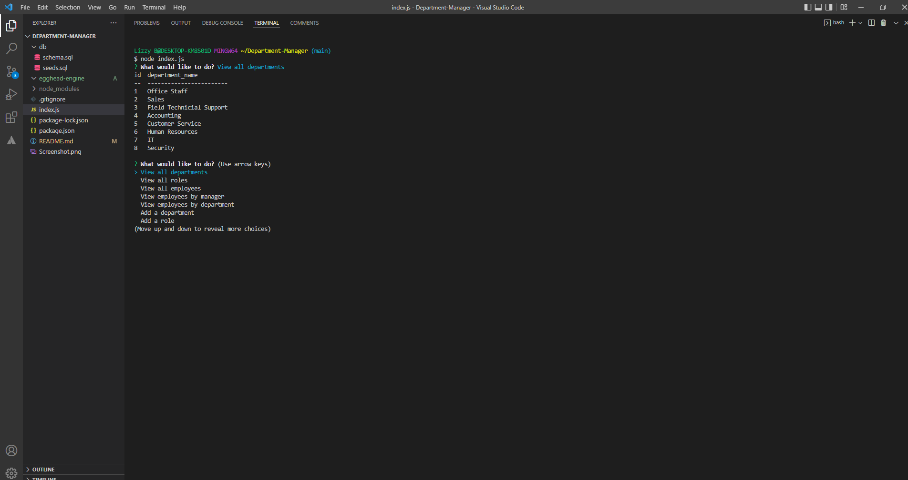

# Department-Manager

## Description

Some features of this command line application.
1. Users can select the option to view all departments, view all roles or view all departments.

2. Users can also choose to view employees by manager and view employees by department.

3. There are options to add roles, employees or departments.

4. Employee’s role and manager can be updated easily.

5. Roles, departments and employees can be deleted.

---

## Table of content

* [Description](#description)

* [Usage](#usage)

* [How to Contribute](#how-to-contribute)

* [Links](#links)

* [Questions](#questions)

* [Technologies](#technologies)

---

## Usage

For keeping track of departments and employees.

## How to Contribute

Pull requests. Feel free to open a pull requst on my GitHub.

## Questions

If you have nay questions about this project then you can contact me directly at 

elizabethdberube@gmail.com

----

## Technologies

Technologies used in this project:

* cTable
* inquirer
* Mysql2

## Links

[GitHub Repo](https://github.com/elizabethdberube/Department-Manager) 

[Walkthrough Video](https://drive.google.com/file/d/1M4ke8uAuSUm5aVSd0nMQ85TcLveKc-pO/view) 

